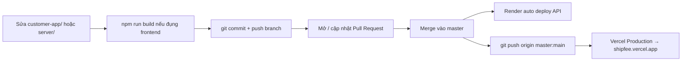

<!-- gitnexus:start -->
# GitNexus — Code Intelligence

This project is indexed by GitNexus as **shipfee** (2801 symbols, 6511 relationships, 251 execution flows). Use the GitNexus MCP tools to understand code, assess impact, and navigate safely.

> If any GitNexus tool warns the index is stale, run `npx gitnexus analyze` in terminal first.

## Always Do

- **MUST run impact analysis before editing any symbol.** Before modifying a function, class, or method, run `gitnexus_impact({target: "symbolName", direction: "upstream"})` and report the blast radius (direct callers, affected processes, risk level) to the user.
- **MUST run `gitnexus_detect_changes()` before committing** to verify your changes only affect expected symbols and execution flows.
- **MUST warn the user** if impact analysis returns HIGH or CRITICAL risk before proceeding with edits.
- When exploring unfamiliar code, use `gitnexus_query({query: "concept"})` to find execution flows instead of grepping. It returns process-grouped results ranked by relevance.
- When you need full context on a specific symbol — callers, callees, which execution flows it participates in — use `gitnexus_context({name: "symbolName"})`.

## Never Do

- NEVER edit a function, class, or method without first running `gitnexus_impact` on it.
- NEVER ignore HIGH or CRITICAL risk warnings from impact analysis.
- NEVER rename symbols with find-and-replace — use `gitnexus_rename` which understands the call graph.
- NEVER commit changes without running `gitnexus_detect_changes()` to check affected scope.

## Resources

| Resource | Use for |
|----------|---------|
| `gitnexus://repo/shipfee/context` | Codebase overview, check index freshness |
| `gitnexus://repo/shipfee/clusters` | All functional areas |
| `gitnexus://repo/shipfee/processes` | All execution flows |
| `gitnexus://repo/shipfee/process/{name}` | Step-by-step execution trace |

## CLI

| Task | Read this skill file |
|------|---------------------|
| Understand architecture / "How does X work?" | `.claude/skills/gitnexus/gitnexus-exploring/SKILL.md` |
| Blast radius / "What breaks if I change X?" | `.claude/skills/gitnexus/gitnexus-impact-analysis/SKILL.md` |
| Trace bugs / "Why is X failing?" | `.claude/skills/gitnexus/gitnexus-debugging/SKILL.md` |
| Rename / extract / split / refactor | `.claude/skills/gitnexus/gitnexus-refactoring/SKILL.md` |
| Tools, resources, schema reference | `.claude/skills/gitnexus/gitnexus-guide/SKILL.md` |
| Index, status, clean, wiki CLI commands | `.claude/skills/gitnexus/gitnexus-cli/SKILL.md` |

<!-- gitnexus:end -->

---

# ShipFee — Hướng Dẫn Dự Án (Production)

## Triển Khai Trực Tuyến (Online Deployment)

| Thành phần | Nền tảng | URL Production |
|------------|----------|----------------|
| **Backend API** | Render | `https://shipfee-eo5s.onrender.com` |
| **Frontend** (Customer, Shipper, CRM) | Vercel | `https://shipfee.vercel.app` |
| **Database** | Supabase + Local JSON chunks | `https://zegfxtprqfksvcukdfif.supabase.co` |

Tất cả triển khai tự động qua **git push** lên nhánh `master` tại [github.com/HieuHuynh23/shipfee](https://github.com/HieuHuynh23/shipfee).

### URL Truy Cập

| Ứng dụng | URL |
|-----------|-----|
| Web Khách Hàng | `https://shipfee.vercel.app/customer-app/` |
| Web Tài Xế | `https://shipfee.vercel.app/shipper-app/` |
| CRM Admin | `https://shipfee.vercel.app/admin-app/` |
| API Status | `https://shipfee-eo5s.onrender.com/api/status` |

---

## Kiến Trúc Hệ Thống

```
d:\FOOD DELIVERY\
├── customer-app/              # Frontend Khách hàng (canonical — https://shipfee.vercel.app/customer-app/)
│   ├── index.html             # Trang chủ — danh sách quán ăn, chọn địa chỉ (Leaflet map)
│   ├── restaurant.html        # Chi tiết quán ăn + thêm vào giỏ
│   ├── checkout.html          # Xác nhận đơn hàng (Leaflet map giao hàng)
│   ├── tracking.html          # Theo dõi đơn hàng (Leaflet map + shipper simulation + WebRTC call)
│   ├── app.js                 # State management, cart, order logic (localStorage)
│   └── style.css              # Design system tokens + components
│
├── shipper-app/               # Frontend Tài xế (canonical — https://shipfee.vercel.app/shipper-app/)
│   ├── index.html             # Giao diện tài xế - HUD dark mode, nhận đơn, live map, chat
│   ├── app.js                 # Logic vuốt kéo, Audio chime synth, nhắn tin, AR/CR rates, WebRTC call
│   └── style.css              # Design system HUD dark theme, slider cảm ứng mobile-first
│
├── admin-app/                 # Frontend CRM Admin (canonical — https://shipfee.vercel.app/admin-app/)
│   ├── index.html             # Bố cục SPA: sidebar + main panel
│   ├── app.js                 # CRUD modules: Dashboard, Orders, Restaurants, Shippers, Customers, Pricing
│   └── style.css              # Dark theme CRM dashboard
│
├── public/                    # Output Vercel (npm run build copy từ các app root)
│   ├── customer-app/
│   ├── shipper-app/
│   └── admin-app/
│
├── server/                    # Backend Node.js Express (Render — port 3001)
│   ├── server.js              # API server chính — REST endpoints, pricing engine, order dispatch, WebRTC signaling
│   ├── dbHelper.js            # Database helper — đọc/ghi chunk files phân mảnh (15 chunks)
│   ├── menuScraper.js         # Puppeteer scraper đối chiếu & đồng bộ giá món ăn với ShopeeFood
│   ├── menu_processor.js      # Xử lý và chuẩn hóa dữ liệu menu từ ShopeeFood
│   ├── restaurants-chunks/    # Database phân mảnh (15 files JSON) chứa thông tin quán + thực đơn
│   ├── menus/                 # Menu riêng lẻ theo từng quán (tách ra từ chunk để tiết kiệm bộ nhớ)
│   ├── orders-local.json      # Cơ sở dữ liệu đơn hàng
│   ├── shippers-local.json    # Cơ sở dữ liệu tài xế
│   ├── pricing-config.json    # Cấu hình giá động (markup, surcharge, min earning...)
│   ├── public/uploads/        # Avatar tài xế đã tải lên
│   ├── .env                   # Environment variables (Supabase, Telegram, TURN server)
│   └── package.json           # Dependencies: express, cors, compression, dotenv, axios, puppeteer-core, supabase
│
├── package.json               # Root: `npm run build` copy app → public/ (Vercel)
├── vercel.json                # outputDirectory=public + redirects
├── crawl_scheduler.js         # Daemon hẹn giờ cào menu ShopeeFood (10h-18h hằng ngày)
├── bulk_crawl.js              # Script cào menu ShopeeFood hàng loạt (chạy thủ công)
├── start_server.ps1           # Launcher local: API + http-server frontend + crawl scheduler
├── AGENTS.md / CLAUDE.md      # Rules cho agent + hướng dẫn dự án
├── PRICING.md                 # Tài liệu thiết kế hệ thống tính giá chi tiết
└── DEPLOYMENT_GUIDE.md        # Hướng dẫn triển khai Render + Vercel + VPS
```

---

## Frontend Source of Truth (BẮT BUỘC khi sửa UI)

| Vai trò | Thư mục | Ghi chú |
|---------|---------|---------|
| **Source chuẩn (sửa ở đây)** | `customer-app/`, `shipper-app/`, `admin-app/` | Code agent/dev phải edit |
| **Output build Vercel** | `public/*` | Được **ghi đè** bởi `npm run build` |

```bash
# Luôn chạy trước khi commit frontend (đồng bộ public/ từ source)
npm run build
```

**Quy tắc agent:**
1. **KHÔNG** chỉ sửa `public/customer-app/` (hoặc public khác) rồi commit — lần build kế tiếp sẽ mất thay đổi.
2. Sửa file trong `customer-app/` (hoặc shipper/admin tương ứng) → chạy `npm run build` → commit **cả** root app + `public/`.
3. Backend chỉ sửa trong `server/` (Render Root Directory = `server`).

---

## Quy trình Deploy lên GitHub → Production



| Bước | Hành động | Kết quả |
|------|-----------|---------|
| 1 | Push branch + mở PR | Code lên GitHub, **chưa** production |
| 2 | Merge PR vào `master` | Render API auto-deploy |
| 3 | Đồng bộ `main = master` | **Bắt buộc** để Vercel Production cập nhật |
| 4 | Vercel Build Command | `npm run build` → serve `public/` |

> **Quan trọng:** GitHub mặc định là `master`, nhưng **Vercel Production Branch = `main`**. Merge PR vào `master` thôi thì `shipfee.vercel.app` **không** đổi — chỉ tạo Preview. Sau mỗi lần merge production-ready, chạy:
> `git fetch origin && git push origin origin/master:main`
> (hoặc merge `master` → `main`). URL production: https://shipfee.vercel.app

Chi tiết: [DEPLOYMENT_GUIDE.md](DEPLOYMENT_GUIDE.md).

---

## Tính Năng Chính

### Độc Lập Dữ Liệu & Xem Thực Đơn
- **Database phân mảnh (15 JSON chunks)**: Thông tin quán + thực đơn được chia nhỏ qua `dbHelper.js` để tối ưu hiệu năng đọc/ghi đồng thời. Menu mỗi quán được tách riêng vào thư mục `menus/`.
- **Phục vụ từ Database Độc lập (ShopeeFood-Independent)**: API phục vụ thực đơn 100% từ dữ liệu local, phản hồi tức thời (<5ms), không phụ thuộc vào ShopeeFood.
- **Đặt cho bản thân** hoặc **Đặt cho người thân** (bắt buộc chọn). Khi đặt cho người thân: nhập tên, SĐT người thân + SĐT người đặt.
- **Ghim vị trí trên bản đồ Leaflet** để shipper giao chính xác (hỗ trợ GPS).
- **Duyệt thực đơn quán đóng cửa**: Xem ở chế độ chỉ đọc (hiển thị "TẠM ĐÓNG") thay vì ẩn quán.

### Hệ Thống Tính Giá (Chi tiết tại PRICING.md)
- **Markup cố định 28%**: `appPrice = round100(inStorePrice × 1.28) + distanceSurcharge`
- **Phụ thu khoảng cách ẩn**: Miễn phí ≤1.5km, trên 1.5km: `round100(7000 × √(d - 1.5))`
- **Ưu đãi đặt nhiều món**: Giảm 15% phụ thu cho món thứ 2 trở đi (tối thiểu 2.000đ/món)
- **Sàn thu nhập shipper**: Tối thiểu 15.000đ/đơn — tự động thu thêm "Phí đơn hàng nhỏ" nếu thiếu
- **Free Ship hiển thị**: Giao diện luôn hiển thị "Miễn phí vận chuyển"

### Đối Chiếu & Đồng Bộ Giá Món Ăn (ShopeeFood Price Sync)
- **ShopeeFood làm dữ liệu đối chiếu**: Hệ thống không phụ thuộc ShopeeFood để hiển thị, nhưng dùng để đối chiếu và cập nhật giá.
- **Daemon tự động (crawl_scheduler.js)**: Chạy hằng ngày 10h-18h, cào menu cho các quán chưa có dữ liệu thực tế.
- **Tính toán tự động giá App**: `appPrice = inStorePrice × (1 + MARKUP_RATE)`.

### Theo Dõi Đơn Hàng & WebRTC Call
- Bản đồ Leaflet 3 markers: Quán (🏪) / Điểm giao (🏠) / Shipper (🛵)
- **Lộ trình đường phố thực tế** qua OSRM API
- **Mô phỏng chuyển động mượt mà** dọc các cung đường
- Trạng thái: PENDING → ACCEPTED → PURCHASED → DELIVERED
- **Gọi điện WebRTC** giữa khách hàng và tài xế (signaling qua API polling)
- **Chat hai chiều** thời gian thực qua API polling 3 giây

### Web App Tài Xế (Shipper Web App)
- **HUD Dark Mode**: Giao diện tối, độ tương phản cao, chuyên nghiệp
- **Swipe to Action**: Vuốt kéo thả (Touch/Mouse), snap-back 90%
- **Nhạc chuông Web Audio API**: Tổng hợp âm thanh báo đơn mới
- **AR/CR Metrics**: Tỷ lệ nhận đơn và hoàn thành đơn
- **Chat & Ghi chú**: Đồng bộ hai chiều với khách hàng

### CRM Admin Dashboard (admin-app)
- **SPA Router**: Dashboard, Orders, Restaurants, Shippers, Customers, Pricing
- **Quản lý quán ăn**: Bật/tắt, chỉnh menu, đồng bộ giá ShopeeFood
- **Quản lý tài xế**: Đăng ký, phê duyệt (Telegram bot), chỉnh sửa, avatar
- **Quản lý đơn hàng**: Theo dõi, gán shipper thủ công, thống kê
- **Pricing Config**: Điều chỉnh markup, surcharge, min earning trực tiếp

---

## Server API Endpoints

### Restaurants
| Endpoint | Method | Mô tả |
|----------|--------|-------|
| `/api/restaurants` | GET | Danh sách quán (`?q=`, `?lat=`, `?lon=`, `?page=1&limit=20` → `hasMore`) |
| `/api/restaurants/:id` | GET | Chi tiết + menu; ưu tiên file/`menus/` rồi hydrate Supabase; scrape queue nếu thiếu |

### Orders
| Endpoint | Method | Mô tả |
|----------|--------|-------|
| `/api/orders` | POST | Tạo đơn hàng mới |
| `/api/orders` | GET | Danh sách đơn (filter: `?shipperPhone=`) |
| `/api/orders/:id` | GET | Chi tiết đơn hàng |
| `/api/orders/:id/accept` | POST | Shipper nhận đơn |
| `/api/orders/:id/decline` | POST | Shipper từ chối đơn |
| `/api/orders/:id/status` | POST | Cập nhật trạng thái đơn |
| `/api/orders/:id/location` | POST | Cập nhật vị trí shipper (per-order) |
| `/api/orders/:id/rate` | POST | Đánh giá đơn hàng |
| `/api/orders/:id/messages` | POST | Gửi/nhận tin nhắn |

### WebRTC Call Signaling
| Endpoint | Method | Mô tả |
|----------|--------|-------|
| `/api/orders/:id/call/initiate` | POST | Khởi tạo cuộc gọi |
| `/api/orders/:id/call/respond` | POST | Phản hồi cuộc gọi (answer/reject/candidate) |
| `/api/orders/:id/call/candidate` | POST | Gửi ICE candidate |
| `/api/orders/:id/call/poll` | GET | Polling trạng thái cuộc gọi (`?role=customer|shipper`) |
| `/api/webrtc/ice-servers` | GET | Lấy cấu hình TURN/STUN servers |

### Shippers
| Endpoint | Method | Mô tả |
|----------|--------|-------|
| `/api/shippers` | GET | Danh sách tất cả tài xế |
| `/api/shippers/login` | POST | Đăng nhập tài xế (JWT) |
| `/api/shippers/register` | POST | Đăng ký tài xế mới (chờ duyệt Telegram) |
| `/api/shippers/shift` | POST | Bật/tắt trực tuyến (auth) |
| `/api/shippers/location` | POST | Cập nhật vị trí GPS tài xế (auth) |
| `/api/shippers/stats` | POST | Thống kê hoạt động tài xế (auth) |
| `/api/shippers/profile` | GET | Xem profile tài xế |

### Admin (CRM) — Yêu cầu JWT Admin
| Endpoint | Method | Mô tả |
|----------|--------|-------|
| `/api/admin/dashboard` | GET | Dữ liệu tổng quan dashboard |
| `/api/admin/shippers` | POST | Thêm tài xế mới |
| `/api/admin/shippers/:oldPhone` | PUT | Cập nhật thông tin tài xế |
| `/api/admin/shippers/:phone` | DELETE | Xóa tài xế |
| `/api/admin/shippers/:phone/approve` | POST | Phê duyệt tài xế |
| `/api/admin/restaurants/:id` | PUT | Cập nhật thông tin quán |
| `/api/admin/restaurants/:id/menu` | PUT | Cập nhật menu quán |
| `/api/admin/restaurants/:id/sync-price` | POST | Đồng bộ giá với ShopeeFood |
| `/api/admin/restaurants/:id/toggle-status` | POST | Bật/tắt hoạt động quán |
| `/api/admin/restaurants/:id/menu/:itemId/toggle-availability` | POST | Bật/tắt món ăn |
| `/api/admin/customers` | GET | Danh sách khách hàng |
| `/api/admin/orders` | GET | Danh sách đơn hàng (admin) |
| `/api/admin/orders/stats` | GET | Thống kê đơn hàng |
| `/api/admin/orders/:id/assign` | POST | Gán shipper cho đơn |
| `/api/admin/pricing-config` | GET | Lấy cấu hình giá |
| `/api/admin/pricing-config` | POST | Cập nhật cấu hình giá |

### Hệ thống
| Endpoint | Method | Mô tả |
|----------|--------|-------|
| `/api/status` | GET | Health check + trạng thái hệ thống |
| `/api/config` | GET | Cấu hình public (markup, surcharge...) |
| `/api/cache/clear` | POST | Xóa cache thủ công |

---

## Chạy Dự Án

### Production (Online — Auto-deploy khi merge `master`)
```bash
# 1) Frontend: sửa source chuẩn rồi build
npm run build

# 2) Commit trên feature branch (khuyến nghị) → PR → merge master
git checkout -b cursor/mo-ta-thay-doi-2feb
git add customer-app public server AGENTS.md CLAUDE.md DEPLOYMENT_GUIDE.md
git commit -m "feat: mô tả thay đổi"
git push -u origin HEAD
# → Mở PR, sau khi merge master: Vercel + Render tự deploy
```

### Local Development (Tùy chọn)
```powershell
# Khởi động toàn bộ hệ thống local (API + Frontend + Crawler Scheduler)
powershell -ExecutionPolicy Bypass -File start_server.ps1

# Chạy crawler thủ công
node bulk_crawl.js --concurrency=2

# Chạy crawler scheduler (force mode — bỏ qua giới hạn giờ)
node crawl_scheduler.js --force
```

---

## Environment Variables (server/.env)

| Biến | Mô tả |
|------|-------|
| `PORT` | Cổng API server (mặc định: 3001) |
| `SUPABASE_URL` | URL dự án Supabase |
| `SUPABASE_ANON_KEY` | Supabase anon/public key |
| `SUPABASE_SERVICE_ROLE_KEY` | Supabase service role key |
| `TELEGRAM_BOT_TOKEN` | Token bot Telegram phê duyệt tài xế |
| `TELEGRAM_CHAT_ID` | Chat ID nhóm Telegram quản trị |
| `METERED_API_KEY` | API key dịch vụ TURN server (WebRTC) — tùy chọn |

---

## Lưu Ý Quan Trọng

- **Source frontend** = `customer-app/` / `shipper-app/` / `admin-app/` — luôn `npm run build` trước commit.
- **Database phân mảnh** (`server/restaurants-chunks/`) là dữ liệu chính — **không xóa**.
- **Menu riêng lẻ** (`server/menus/`) gitignore — sau deploy hydrate từ Supabase; không ghi menu mẫu giả lên disk.
- **Customer perf**: list `page/limit` + cache nearby 30s; client paint cache ngay; detail soft-revalidate; scrape queue concurrency 2.
- **Auto-deploy**: chỉ khi **merge/push `master`** → Render (API) + Vercel (frontend). PR branch chưa phải production.
- **Render Root Directory**: `server` — Build: `npm install` — Start: `node server.js`.
- **Vercel**: Build Command `npm run build`, Output `public` (xem `vercel.json`).
- **Crawl Scheduler**: Daemon 10h–18h; Sweep Worker **tắt trên Render** (tránh OOM).
