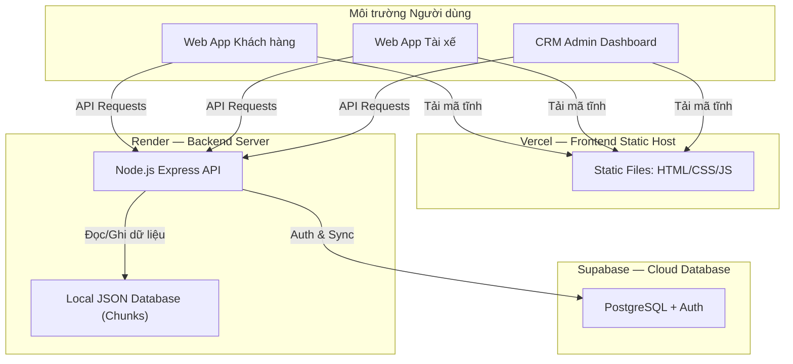

# Hướng Dẫn Triển Khai Hệ Thống ShipFee (Deployment Guide)

Tài liệu này hướng dẫn chi tiết cách thức triển khai và vận hành hệ thống **ShipFee** trên hai môi trường: **Production (Online)** và **Local Development**.

---

## 1. Tổng Quan Kiến Trúc Hệ Thống

Hệ thống **ShipFee** được thiết kế theo mô hình tách biệt **Frontend** và **Backend API**, triển khai trên hai nền tảng cloud miễn phí:



### Thành phần:
- **Frontend** (Vercel): 3 ứng dụng tĩnh (HTML/CSS/JS)
  - `/customer-app`: Khách hàng đặt món, chọn địa chỉ, theo dõi đơn
  - `/shipper-app`: Tài xế nhận đơn, giao hàng, chat, gọi điện
  - `/admin-app`: CRM quản lý quán, tài xế, đơn hàng, pricing
- **Backend** (Render): Node.js Express API + JSON database phân mảnh
- **Database bổ trợ** (Supabase): PostgreSQL cho auth và đồng bộ dữ liệu

---

## 2. Triển Khai Production Hiện Tại (Render + Vercel)

### 2.1. URL Production

| Thành phần | URL |
|------------|-----|
| **Web Khách Hàng** | `https://shipfee.vercel.app/customer-app/` |
| **Web Tài Xế** | `https://shipfee.vercel.app/shipper-app/` |
| **CRM Admin** | `https://shipfee.vercel.app/admin-app/` |
| **Backend API** | `https://shipfee-eo5s.onrender.com` |
| **API Health Check** | `https://shipfee-eo5s.onrender.com/api/status` |

### 2.2. Cấu Hình Render (Backend API)

| Cài đặt | Giá trị |
|---------|---------|
| **Repository** | `github.com/HieuHuynh23/shipfee` |
| **Branch** | `master` |
| **Root Directory** | `server` |
| **Build Command** | `npm install` |
| **Start Command** | `node server.js` |
| **Node Version** | 24.x (mặc định) |
| **Instance Type** | Free |

#### Environment Variables trên Render Dashboard:

| Biến | Mô tả | Bắt buộc |
|------|-------|----------|
| `PORT` | Cổng API (Render tự gán) | ❌ |
| `SUPABASE_URL` | URL dự án Supabase | ✅ |
| `SUPABASE_ANON_KEY` | Supabase anon/public key | ✅ |
| `SUPABASE_SERVICE_ROLE_KEY` | Supabase service role key | ✅ |
| `TELEGRAM_BOT_TOKEN` | Token bot Telegram phê duyệt tài xế | ✅ |
| `TELEGRAM_CHAT_ID` | Chat ID nhóm Telegram quản trị | ✅ |
| `METERED_API_KEY` | API key TURN server (WebRTC) | ❌ |

> **Lưu ý**: File `.env` trên local dùng cho phát triển. Trên Render, cấu hình qua Dashboard → Environment.

### 2.3. Cấu Hình Vercel (Frontend)

| Cài đặt | Giá trị |
|---------|---------|
| **Repository** | `github.com/HieuHuynh23/shipfee` |
| **Branch** | `master` |
| **Framework Preset** | Other |
| **Root Directory** | (trống — root của repo) |

#### Cấu trúc frontend (canonical → Vercel)

- Source: `customer-app/`, `shipper-app/`, `admin-app/` ở root repo
- Build: `npm run build` copy vào `public/` (outputDirectory)
- Production domain: `https://shipfee.vercel.app`

#### File `vercel.json`:
```json
{
  "cleanUrls": false,
  "outputDirectory": "public",
  "redirects": [
    { "source": "/", "destination": "/customer-app/", "permanent": false },
    { "source": "/shipper", "destination": "/shipper-app/", "permanent": false },
    { "source": "/admin", "destination": "/admin-app/", "permanent": false }
  ]
}
```

### 2.4. Quy Trình Deploy Tự Động

```bash
# Mọi thay đổi push lên master → tự động deploy
git add .
git commit -m "feat: mô tả thay đổi"
git push origin master
# → Render tự build lại backend (2-3 phút)
# → Vercel tự build lại frontend (30-60 giây)
```

### 2.5. Auto-Detect API URL (Frontend)

Tất cả 3 frontend app đều có cơ chế tự động phát hiện môi trường:

```javascript
const defaultApiUrl = (window.location.hostname === 'localhost' || ...)
  ? 'http://localhost:3001'           // Local development
  : 'https://shipfee-eo5s.onrender.com';  // Production

// Fetch interceptor tự động thay thế localhost → Render URL
window.fetch = function(input, init) {
  if (input.startsWith('http://localhost:3001')) {
    input = input.replace('http://localhost:3001', API_BASE);
  }
  // ... thêm JWT Authorization header
};
```

---

## 3. Xử Lý Sự Cố Phổ Biến (Troubleshooting)

### 3.1. Render: `Error: Cannot find module 'dotenv'`
**Nguyên nhân**: File `server/package.json` trên GitHub thiếu dependency.
**Giải pháp**: Đảm bảo `server/package.json` có đầy đủ dependencies và đã được push lên GitHub:
```json
{
  "dependencies": {
    "dotenv": "^16.4.5",
    "@supabase/supabase-js": "^2.45.0",
    "express": "^4.19.2",
    "cors": "^2.8.5",
    "compression": "^1.8.1",
    "axios": "^1.7.2",
    "cheerio": "^1.2.0",
    "puppeteer-core": "^25.1.0",
    "puppeteer-extra": "^3.3.6",
    "puppeteer-extra-plugin-stealth": "^2.11.2"
  }
}
```

### 3.2. Render: API trả về 502/503
**Nguyên nhân**: Free tier Render spin down sau 15 phút không có request.
**Giải pháp**: Gửi lại request, server sẽ tự khởi động lại (cold start ~30-60 giây).

### 3.3. Vercel: Trang trắng hoặc 404
**Nguyên nhân**: File `vercel.json` thiếu hoặc sai cấu hình.
**Giải pháp**: Kiểm tra `vercel.json` có đúng cấu hình redirects ở mục 2.3.

---

## 4. Môi Trường Phát Triển Cục Bộ (Local Development)

### Cấu hình Cổng (Ports) & Đường dẫn:
| Thành phần | Cổng | URL |
|------------|------|-----|
| Backend API | 3001 | `http://localhost:3001/api` |
| Frontend Static | 8000 | `http://localhost:8000/customer-app/index.html` |
| Shipper App | 8000 | `http://localhost:8000/shipper-app/index.html` |
| CRM Admin | 8000 | `http://localhost:8000/admin-app/index.html` |

### Cách khởi động:
```powershell
# Khởi động toàn bộ hệ thống (API + Frontend + Crawler Scheduler)
powershell -ExecutionPolicy Bypass -File start_server.ps1
```

Script `start_server.ps1` tự động:
1. Kiểm tra Node.js và cài đặt dependencies
2. Giải phóng cổng 3001 và 8000 nếu bị chiếm
3. Khởi động API server (Node.js Express)
4. Khởi động Frontend server (http-server với gzip + CORS)
5. Khởi động Crawl Scheduler daemon (10h-18h)
6. Mở trình duyệt và giám sát tiến trình

---

## 5. Phương Án Mở Rộng — Triển Khai VPS/Server Riêng

Khi doanh nghiệp cần hiệu năng cao hơn hoặc custom domain, có thể chuyển sang VPS:

### Bước 1: Mua tên miền và VPS
- Mua **1 tên miền** (ví dụ: `shipfee.vn`)
- Thuê **1 VPS** Linux (Ubuntu 22.04 LTS) từ DigitalOcean, Vultr, AWS, etc.

### Bước 2: Cài đặt môi trường
```bash
curl -fsSL https://deb.nodesource.com/setup_18.x | sudo -E bash -
sudo apt-get install -y nodejs nginx
sudo npm install -y pm2 -g
```

### Bước 3: Chạy Backend API
```bash
cd /path/to/project/server
npm install
pm2 start server.js --name "shipfee-api"
pm2 save && pm2 startup
```

### Bước 4: Cấu hình Nginx
```nginx
server {
    listen 80;
    server_name shipfee.vn api.shipfee.vn shipper.shipfee.vn;

    location /api/ {
        proxy_pass http://localhost:3001;
        proxy_http_version 1.1;
        proxy_set_header Upgrade $http_upgrade;
        proxy_set_header Connection 'upgrade';
        proxy_set_header Host $host;
    }

    location / {
        root /path/to/project/customer-app;
        index index.html;
        try_files $uri $uri/ =404;
    }

    location /shipper/ {
        alias /path/to/project/shipper-app/;
        index index.html;
        try_files $uri $uri/ =404;
    }

    location /admin/ {
        alias /path/to/project/admin-app/;
        index index.html;
        try_files $uri $uri/ =404;
    }
}
```

### Bước 5: SSL/HTTPS miễn phí
```bash
sudo apt-get install certbot python3-certbot-nginx -y
sudo certbot --nginx -d shipfee.vn -d api.shipfee.vn -d shipper.shipfee.vn
```

---

## 6. Kết Luận

Kiến trúc **ShipFee** hiện tại cho phép:
1. **Triển khai miễn phí** trên Render + Vercel với auto-deploy qua Git
2. **Phát triển nhanh** ở môi trường local không tốn chi phí
3. **Mở rộng linh hoạt** sang VPS/custom domain khi cần
4. **Tách biệt hoàn toàn** frontend và backend — nâng cấp độc lập
