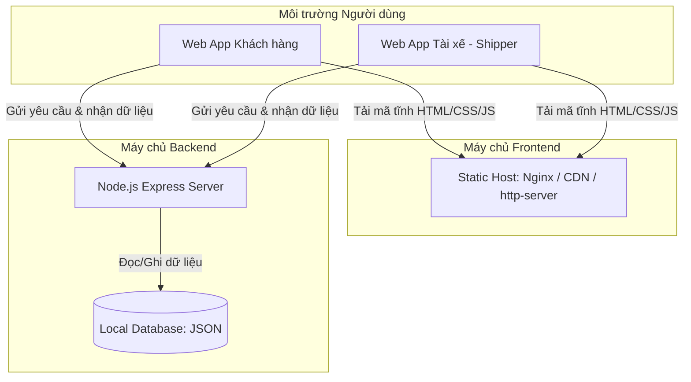

# Hướng Dẫn Kiến Trúc Hệ Thống & Triển Khai (Deployment Guide)

Tài liệu này hướng dẫn chi tiết cách thức tổ chức máy chủ, phân bổ đường dẫn (URL) và quy trình vận hành hệ thống **ShipFee** ở hai môi trường: **Môi trường Phát triển (Local Development)** và **Môi trường Thực tế (Production)**.

---

## 1. Tổng Quan Kiến Trúc Hệ Thống

Hệ thống **ShipFee** được thiết kế theo mô hình tách biệt giữa **Giao diện (Frontend)** và **Mã nguồn xử lý (Backend API)**, giúp tối ưu hiệu năng chịu tải và khả năng mở rộng.



* **Frontend**: Được cấu thành từ mã nguồn tĩnh thuần túy (HTML, CSS, JS) nằm trong hai thư mục:
  * `/customer-app`: Dành cho khách hàng đặt món, chọn địa chỉ và theo dõi đơn.
  * `/shipper-app`: Dành cho tài xế trực tuyến, nhận đơn qua thanh vuốt, theo dõi bản đồ live và tương tác chat.
* **Backend**: Chạy bằng Node.js Express (`server.js`) quản lý cơ sở dữ liệu `restaurants-local.json` và `orders-local.json`, cung cấp các cổng API cho cả hai ứng dụng khách hàng và tài xế.

---

## 2. Môi Trường Phát Triển Cục Bộ (Local Development)

Hiện tại, trong quá trình phát triển và kiểm thử, hệ thống hoạt động hoàn toàn cục bộ trên máy tính cá nhân (Localhost) và **không tốn bất kỳ chi phí mua tên miền hay máy chủ nào**.

### Cấu hình Cổng (Ports) & Đường dẫn:
* **Frontend Static Server** (Chạy qua thư viện tĩnh `http-server` hoặc `npx http-server`):
  * **Cổng (Port)**: `8000`
  * **Trang Khách Hàng**: `http://localhost:8000/customer-app/index.html`
  * **Trang Tài Xế**: `http://localhost:8000/shipper-app/index.html`
* **Backend API Server** (Chạy qua Node.js Express):
  * **Cổng (Port)**: `3001`
  * **Đường dẫn API**: `http://localhost:3001/api`

### Cách khởi động:
Bạn chỉ cần chạy tệp lệnh [start_server.ps1](file:///d:/FOOD%20DELIVERY/start_server.ps1) bằng PowerShell để tự động kích hoạt cả hai máy chủ tĩnh và API đồng thời:
```powershell
powershell -ExecutionPolicy Bypass -File start_server.ps1
```

---

## 3. Môi Trường Thực Tế (Production Deployment)

Khi đưa hệ thống vào sử dụng thực tế và công khai cho doanh nghiệp, bạn **CHỈ CẦN MUA DUY NHẤT 1 TÊN MIỀN** chính (ví dụ: `shipfee.vn`). Dưới đây là hai phương án phân bổ hạ tầng phổ biến:

### Phương Án A: Sử dụng Tên Miền Con (Subdomain) - KHUYÊN DÙNG
Phương án này giúp phân chia rõ ràng thương hiệu và tăng khả năng chịu tải độc lập cho từng dịch vụ. Tên miền con là **hoàn toàn miễn phí** sau khi bạn mua tên miền chính.

| Thành phần | URL Công khai | Cách thức cấu hình máy chủ |
| :--- | :--- | :--- |
| **Web Khách Hàng** | `https://shipfee.vn` hoặc `https://app.shipfee.vn` | Trỏ thư mục tĩnh `/customer-app` trên Hosting/Nginx. |
| **Web Tài Xế** | `https://shipper.shipfee.vn` | Trỏ thư mục tĩnh `/shipper-app` trên Hosting/Nginx. |
| **Backend API** | `https://api.shipfee.vn` | Chạy ứng dụng Node.js Express ở cổng nội bộ và chuyển tiếp (Reverse Proxy) qua tên miền này. |

> [!TIP]
> Bạn có thể quản lý và trỏ các subdomain này hoàn toàn miễn phí thông qua trang quản trị DNS của nhà cung cấp tên miền (ví dụ: Cloudflare, Mắt Bão, Tenten, Pavietnam, Namecheap...).

---

### Phương An B: Chạy chung 1 Tên Miền qua Đường Dẫn (Subfolder)
Phương án này giúp tối giản hóa cấu hình chứng chỉ SSL/HTTPS vì tất cả dịch vụ đều nằm dưới cùng một tên miền duy nhất.

* **Trang Khách Hàng**: `https://shipfee.vn/` (Trang chủ)
* **Trang Tài Xế**: `https://shipfee.vn/shipper/` (Trỏ tới thư mục `/shipper-app`)
* **Đường dẫn API**: `https://shipfee.vn/api/` (Chuyển tiếp yêu cầu AJAX từ trình duyệt đến máy chủ Node.js Express đang chạy ẩn phía sau).

---

## 4. Hướng Dẫn Từng Bước Triển Khai Lên VPS/Server Thực Tế

### Bước 1: Mua tên miền và Máy chủ (VPS)
* Mua **1 tên miền** từ bất kỳ nhà cung cấp nào.
* Thuê **1 máy chủ ảo (VPS)** chạy hệ điều hành Linux (Ubuntu Server 20.04/22.04 LTS được khuyến nghị) từ các nhà cung cấp như DigitalOcean, Vultr, AWS, Google Cloud, Hostinger, v.v.

### Bước 2: Cài đặt môi trường trên VPS
Cài đặt Node.js và trình quản lý tiến trình ngầm `pm2` để giữ API server chạy 24/7 không bị tắt:
```bash
# Cài đặt Node.js
curl -fsSL https://deb.nodesource.com/setup_18.x | sudo -E bash -
sudo apt-get install -y nodejs

# Cài đặt PM2 để quản lý tiến trình chạy ngầm
sudo npm install -y pm2 -g
```

### Bước 3: Chạy Backend API ngầm
Đưa mã nguồn của hệ thống lên VPS, di chuyển vào thư mục `/server` và khởi động qua `pm2`:
```bash
cd /path/to/project/server
npm install
pm2 start server.js --name "shipfee-api"
pm2 save
pm2 startup
```

### Bước 4: Cấu hình Web Server Nginx làm Reverse Proxy và phân phối File Tĩnh
Cài đặt Nginx để vừa phân phối file tĩnh của hai App vừa làm lá chắn bảo mật cho API:
```bash
sudo apt-get install nginx -y
```

Cấu hình tệp `/etc/nginx/sites-available/default` tương tự như sau:
```nginx
server {
    listen 80;
    server_name shipfee.vn shipper.shipfee.vn api.shipfee.vn;

    # 1. Định cấu hình API Server
    location /api/ {
        proxy_pass http://localhost:3001; # Chuyển tiếp tới Node.js API chạy ở port 3001
        proxy_http_version 1.1;
        proxy_set_header Upgrade $http_upgrade;
        proxy_set_header Connection 'upgrade';
        proxy_set_header Host $host;
        proxy_cache_bypass $http_upgrade;
    }

    # 2. Định cấu hình Web App Khách hàng (shipfee.vn)
    location / {
        root /path/to/project/customer-app;
        index index.html;
        try_files $uri $uri/ =404;
    }

    # 3. Định cấu hình Web App Shipper (shipper.shipfee.vn hoặc thư mục con)
    location /shipper/ {
        alias /path/to/project/shipper-app/;
        index index.html;
        try_files $uri $uri/ =404;
    }
}
```

### Bước 5: Cài đặt chứng chỉ bảo mật SSL (HTTPS) miễn phí
Sử dụng Let's Encrypt (Certbot) để tự động kích hoạt giao thức HTTPS bảo mật cho hệ thống:
```bash
sudo apt-get install certbot python3-certbot-nginx -y
sudo certbot --nginx -d shipfee.vn -d shipper.shipfee.vn -d api.shipfee.vn
```
Certbot sẽ tự động cấu hình lại Nginx, chuyển hướng tất cả lưu lượng HTTP thường sang HTTPS bảo mật 100%.

---

## 5. Kết Luận
Kiến trúc tách biệt Frontend & Backend hiện tại của **ShipFee** cho phép doanh nghiệp của bạn:
1. Phát triển nhanh chóng ở môi trường cục bộ (Localhost) không tốn chi phí.
2. Tiết kiệm chi phí tên miền khi ra thực tế (chỉ cần mua duy nhất 1 tên miền chính).
3. Đảm bảo tính linh hoạt tối đa khi mở rộng quy mô, nâng cấp độc lập giao diện khách hàng hoặc tài xế mà không ảnh hưởng tới lõi dữ liệu phía sau.
